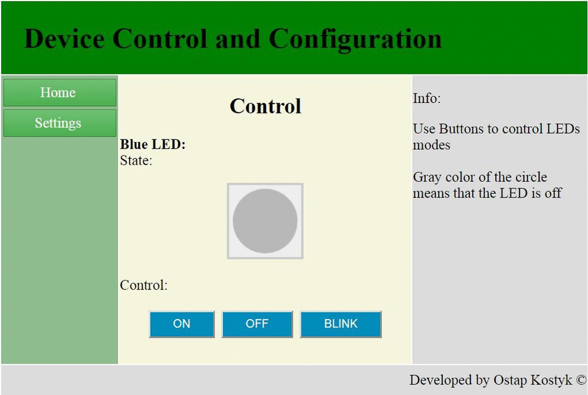
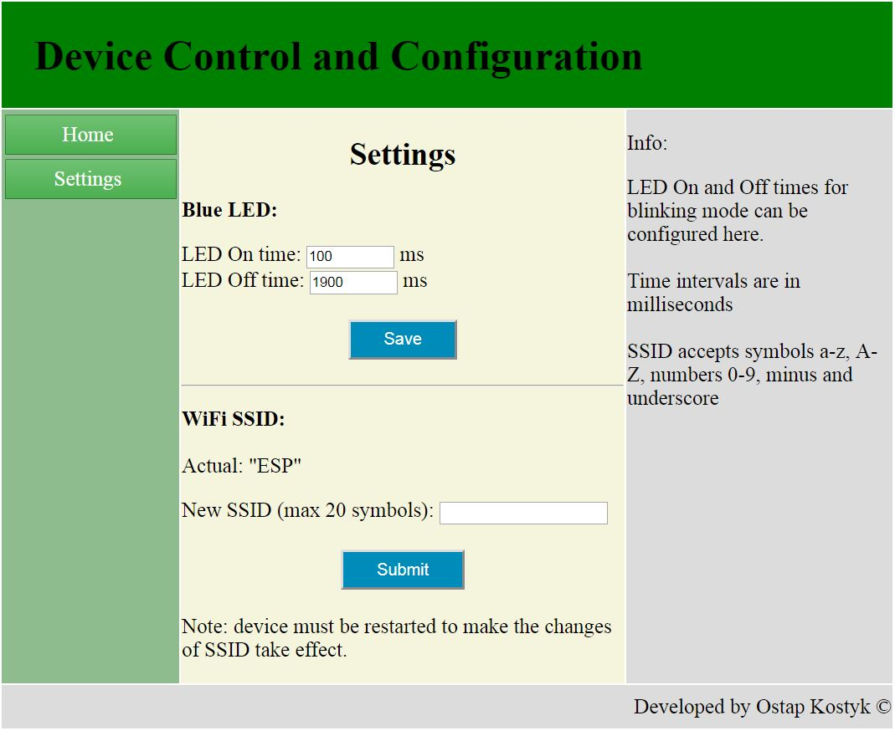

# HTTP Server using ESP8266

## Contents
1. [Overview](#overview)
2. [Details of implementation](#details-of-implementation)
3. [Example](#example)
4. [IDE](#ide)
5. [Build instructions](#build-instructions)
6. [Other notes](#other-notes)

## [Overview](#section-overview)
The goal of this project is to add low-cost and easy-to-implement user interface to the embedded system in form of HTTP server over WiFi. The project is oriented on "Bare-metal" hardware (no special requirements to HW). Cheap $2 modem ESP8266 is used as modem and enables WiFi communication. This solution lets you configure your device and read-out status information using PC/phone/tablet without the headache of implementing the displays, buttons, case etc.

No OS or file system is needed to implement this HTTP server. As an example, the project is implemented using STM32F103 microcontroller controlling one LED. I tried to keep code of HTTP server and ESP8266 modem "driver" portable and to keep hardware-dependant parts separately. One free UART port is needed for communication with ESP8266 modem and optionally one digital output can be used to enable/disable modem.
HTML code is simply inserted as the string (on-line converters can convert HTML code to C-string in a few cliks). User-application can dynamicly generate content, read variables from GET/POST methods, read some info from HTTP header such as Host, HTTP version.

## [Details of implementation](#section-features)

ESP class handles states and communication with ESP8266 module over UART using AT-commands. 

HTTP_Server class implements tiny HTTP server that can be used with ESP8266 only and can serve up to 5 clients at a time (limited by ESP8266 module). 

ESP8266_Interface.h contains hardware-dependant functions used by ESP class, such as UART initialization, Send to UART, Get char from UART etc. 

HTTP_content.c contains HTTP header, content of pages, list of recognized variables from GET/POST requests

Current implementation uses STM32F103C8 microcontroller from ST. STM32CubeMX code generator can be used to add/change hardware configuration which allows fast start. Blue LED is controlled as an example ("Hello World!" application) in this project. Main HTTP page displays mode of the LED (Off, On, or blinking) and allows user to switch between that modes using buttons. Second page "Settings" lets user configure On/Off time of the LED in blinking mode and change SSID of the WiFi Access Point. All settings are being stored in emulated EEPROM (in  the flash memory of the controller) and get restored after power toggle.

Other classes are well described in my other repository (https://github.com/ostapkostyk/STM32F1-Template)

HTTP pages in this example use scripts for animation and look like:




## [Example](#section-example)

Create ESP8266 and HTTP Server instances:
```C
/* Create ESP instance. Urgument is the number (uint8_t) of UART port used for this ESP8266 */
ESP ESP1{ESP1_HUART_NUM};

/* Create HTTP server instance */
HTTP_Server MyHTTPServer{&ESP1};
```
Prepare ESP module:
```C
if(ESP1.GetCurrentModuleMode() == ESP::eModuleMode::Undefined)
{
    /*  Switch WiFi module to AccessPoint mode (not Station) */ 
    ESP1.SwitchToAccessPointMode(AccessPointName, (char*)AccessPointPassword, 6, ESP::eECNType::WPA2_PSK);  
}
else if(ESP1.GetCurrentModuleMode() == ESP::eModuleMode::AccessPoint)   /*  switched to AccessPoint mode successfully */
{
  /*  start AP */
  if(ESP1.LocalAccessPointState() == ESP::eAccessPointState::Started)   /*  AccessPoint started */
  {
      /*  start server */
      switch(ESP1.GetServerState())
      {
      case ESP::eServerState::Connected:
           if(ESP1.SetAccessPointIP(AP_DefaultIP, AP_DefaultIP, AP_DefaultNetMask)) break;    //  wait for IP change
           WiFi_Step++;  /*  go to next step */
           break;

      case ESP::eServerState::Disconnected:
      case ESP::eServerState::Undefined:
           ESP1.StartServer((unsigned int)80);
           break;

      case ESP::eServerState::Error:
      case ESP::eServerState::ConnectTimeout:
      default:
          //TODO
          break;
      }
  }
}
else {/* Error */}
```
Run HTTP server:
```C
/*  run HTTP server */
  MyHTTPServer.Handle();
```
HTTP content looks like:
```C
/* Header info */
const char HTTP_Header[] =
        "<!DOCTYPE html PUBLIC \"-//W3C//DTD HTML 4.01//EN\"\n"
        "\"http://www.w3.org/TR/html4/strict.dtd\">\n"
        "<html lang=\"en\">\n"
        "<head>\n"
        /*........ other HTML code here like CSS style etc. ......... */
        "</style>\n"
        "</head>\n";
        
/* index.html page */
const char HTTP_Index_Body1[] =
        "<body>\n"
        "<div>\n"
        "<table style=\"height: 280px; width: 100%;\">\n"
        /*........ other HTML code here ......... */
        "</body>\n"
        "</html>";
        
// dynamic part of index.html page
char HTTP_Index_Body2[] = "0";    //  initialized string
        
        // static part of index.html page
const char HTTP_Index_Body3[] =
        "</table>\n"
        "</div>\n"
        "<script>\n"
        /*........ other HTML code here ......... */
                "</script>\n"
        "</body>\n"
        "</html>";
```
Then, the page consists of references to strings, which can be "static" (constant strings located in the flash memory like example above) or "dynamic" (generated by application when page is requested). I used this concept to optimize resources, so that constant parts of content remain in relatively large flash memory and do not need to be copied into RAM. Only changing part of content (which can be minimized to tens or hundreds of bytes) remains in RAM and needs to be generated by application. At the moment I decided not to use PHP-like preprocessor to generate complete page using variables because it would take much more CPU resources (CPU time to work with variables and RAM to generate resulting page). Maybe I'll try PHP-like preprocessor in the future.

When combining the page, 2-dimension array is initialized with references to strings and with the size of the string. Then, during initialization, HTTP Server analizes this array. Entries with non-zero size are considered as "static" and entries with zero-size are considered as "dynamic". Then, when replying to the client, Server sends "static" parts directly by reference from the flash and calls external function to generate content for "dynamic" parts. Then it calculates the length of generated string using strlen() function from STD. If needed, user application can set the flag to signalize server that application must execute some process before generating the page so that result of execution can be included in response to the client immediately.  
```C
HTTP_Page IndexPage[] = {{HTTP_Header, sizeof(HTTP_Header)}, {HTTP_Index_Body1, sizeof(HTTP_Index_Body1)}, {HTTP_Index_Body2, 0}, {HTTP_Index_Body3, sizeof(HTTP_Index_Body3)}};
```
Finally, the list of available pages looks like array with closing line filled with zeros:
```C
/* ====== Array of pages. First page must be home page. Last record in array must be zeros ======= */
HTTPServerContent_t HTTPServerContent[] = {
/*|--------------|---------------------------------------|-------------------|---------------------------------*/
/*|  *pPage      |   PageParts                           |   *pPageName        |   HTTP_PageType        --     */
/*|--------------|---------------------------------------|-------------------|---------------------------------*/
/*| Pointer on   | sizeof(<ArrayName>)/sizeof(HTTP_Page) | Pointer or string | Any value, field is filled by   */
/*|    Array     |                                       | with page name    |application during initialization*/
/*|--------------|---------------------------------------|-------------------|---------------------------------*/
  { IndexPage,    sizeof(IndexPage)/sizeof(HTTP_Page),      "index.html",           HTTP_PageType::Static    },
  { SettingsPage, sizeof(SettingsPage)/sizeof(HTTP_Page),   "settings.html",        HTTP_PageType::Static    },
/*|--------------|---------------------------------------|-------------------|---------------------------------*/
                            /* ENDING ELEMENT, DO NOT CHANGE!!! */
   {     0,                      0,                              0,                  HTTP_PageType::Static   }
};

```
Variables that can be read from HTTP GET/POST requests are the linked list of HTTPVariable class instances. When created, instance is initialized with variable name, type and maximum string length in case variable should hold text string in it (constructor allocates memory for the string and never frees it; not flexible but prevents from memory fragmentation problems). When the Server receives HTTP request with variable from the list, it reads-out the value according to it's type and sets the flag that the new value has been received. Also the Server sets general flag that there is at least one variable received. Using these flags it is easy and time-efficient to react on new values in user application:
```C
/* Creating variables: */
HTTPVariable HTTP_VAR_BlueLEDMode("BlueLEDMode", HTTPVariable::HTTPVarType::Text, 20);
HTTPVariable HTTP_VAR_BlueLEDBlinkTimeOn("BlueLEDBlinkTimeOn", HTTPVariable::HTTPVarType::Integer);
```
```C
/* Usage of "HTTP variables" */
if(HTTPVariable::HTTPVariableReceivedFlag)    /*  Global variable, sets true if any variable from the list received (to save CPU time) */
{
    if(HTTP_VAR_BlueLEDMode.NewValueReceived())   /*  "BlueLEDMode" received (Text variable) */
    {
        if(HTTP_VAR_BlueLEDBlinkTimeOn.GetValueInteger() > 0)
        {
            /* some user-action */
        }
    }
}
```

## [IDE:](#section-generation)

IDE for the project is STM32CubeIDE. Formerly, when STM32CubeIDE didn't exist, manually prepared toolchain (Eclipse+GCC+GDB) was used to build and debug.

The project is prepared to use STM32CubeMX to generate the code from the visual configuration.

User code in main.cpp is enclosed between autogenerated comments used by CubeMX to keep it untouched. main.cpp in Git repository is adapted main.c generated by CubeMX, so the structure of code is similar. At the moment, CubeMX doesn't discover C++ project type (even when properly configured in IDE) and generates code into main.c file instead of main.cpp. The easiest way to solve this is to rename main.cpp to main.c, then generate code by CubeMX (in IDE) and then rename main.c to main.cpp back.

At the end, to re-generate HW configuration and update HAL drivers the only one thing has to be done - renaming of main.c

## [Build instructions](#section-build-instructions)
- Size optimization should be enabled in the IDE for the built-in flash size of 64K, otherwise the project will not fit into flash memory if EEPROM emulation is enabled (it takes 99,67% flash without space for EEPROM emulation). 

- defines USE_CUSTOM_MEMMGR and EEPROM_EMULATION_EN should be added as preprocessor define symbols in order to build the project without modifications (in STM32CubeIDE File->Properties->C/C++ Build->Settings->Tool Settings->MCU G++ Compiler->Preprocessor)

- HTTP_SERV_SUPPORT_FLOATING_POINT_VARS should be added as preprocessor define symbol in order to parse floating-point variables in the HTTP requests. In this case "use float with scanf" option should be enabled in IDE (MCU settings). This "hungry" feature adds about 12K to the FLASH footprint.

- when EEPROM emulation is enabled and it's size should be modified, then the linker script *.ld file should be adapted (MEMORY{} structure) to the new size of emulated eeprom, equal to 2x PAGE_SIZE in eeprom.h


## [Other notes](#section-other)
- I tried to make this application deterministic and therefore all instances of classes can be created by constructor but cannot be destroyed (no destructor exists) to prevent memory fragmentation and related problems.

- Footprint of the compiled project with -O1 optimization:
```
   text	   data	    bss	    dec	    hex	filename
  48980	    320	   9960	  59260	   e77c	GenericSTM32F.elf
```

- Small video presentation:

[](https://www.youtube.com/watch?v=9brijFgNL5U)